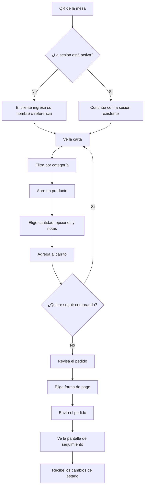
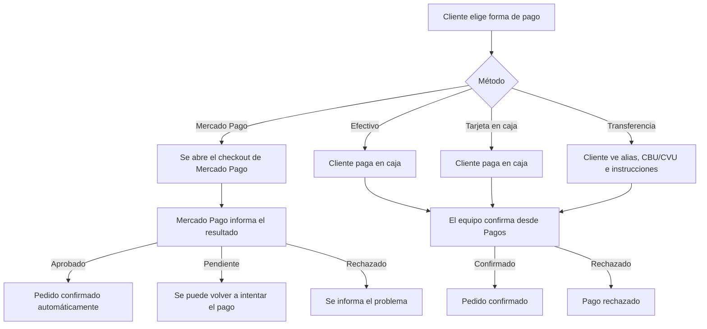
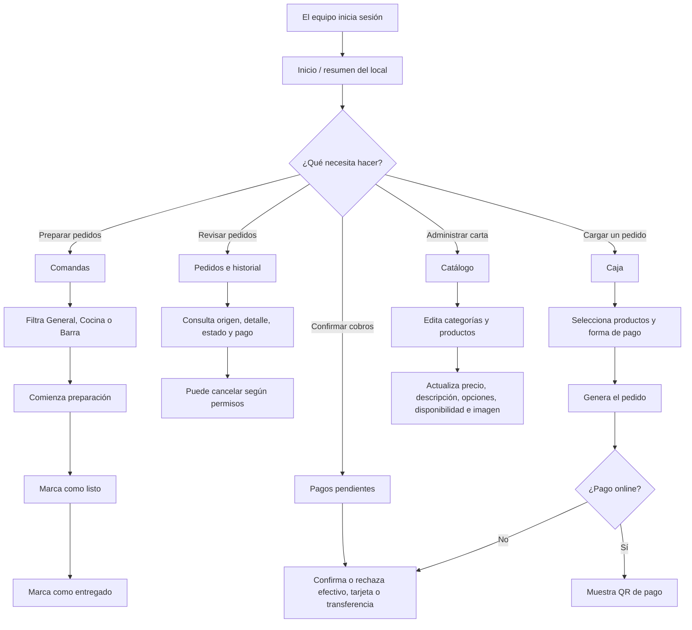
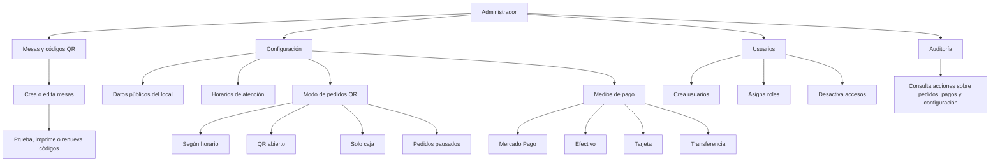
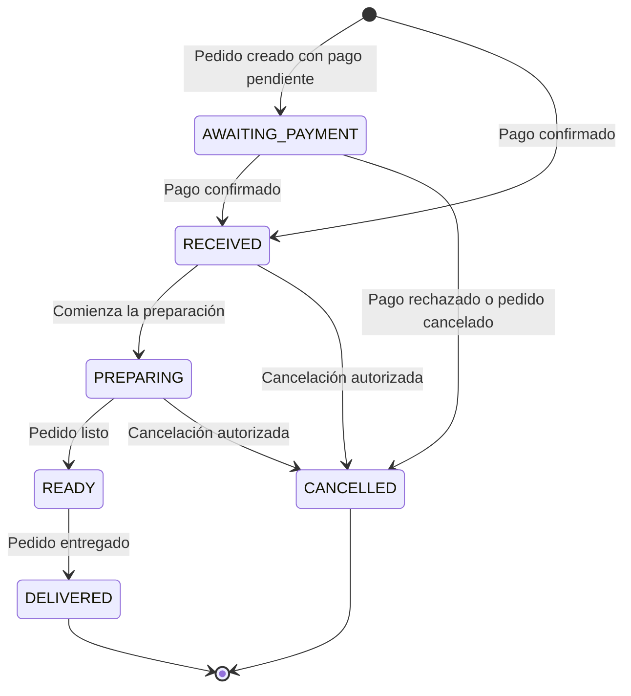

# Flujo completo de la aplicación

Este documento explica, en lenguaje simple, cómo funciona la plataforma de pedidos QR desde el punto de vista del cliente y del negocio.

## Vista general

```mermaid
flowchart LR
    A[Cliente escanea el QR de la mesa] --> B[Se abre la carta del local]
    B --> C[Cliente elige productos]
    C --> D[Agrega opciones, cantidades y notas]
    D --> E[Revisa el carrito]
    E --> F[Elige forma de pago]

    F -->|Mercado Pago| MP[Se genera el pago online]
    MP --> MP2{Mercado Pago acredita el pago?}
    MP2 -->|Sí| G[Pedido confirmado]
    MP2 -->|No / pendiente| P[Pedido pendiente de pago]

    F -->|Efectivo en caja| M[Pedido pendiente de confirmación]
    F -->|Tarjeta en caja| M
    F -->|Transferencia bancaria| M
    M --> N[El equipo verifica el cobro desde Pagos]
    N -->|Confirma| G
    N -->|Rechaza| R[Pago rechazado]

    G --> H[El pedido aparece en Comandas]
    H --> I[Preparando]
    I --> J[Listo]
    J --> K[Entregado]

    P -->|Cliente completa el pago| G
    P -->|El cliente no paga| P2[El pedido continúa pendiente]

    G -. actualiza .-> S[Seguimiento del cliente]
    I -. actualiza .-> S
    J -. actualiza .-> S
    K -. actualiza .-> S
```

## Recorrido del cliente

## Formas de pago

## Operación del negocio

## Administración y configuración

## Estados principales de un pedido

## Qué incluye la primera versión

- Carta digital accesible desde QR.
- Carrito y envío de pedidos.
- Seguimiento del pedido.
- Mercado Pago, efectivo, tarjeta y transferencia.
- Confirmación manual de pagos que se realizan en el local.
- QR de pago para pedidos cargados desde caja.
- Comandas para organizar la preparación.
- Gestión de productos, categorías e imágenes.
- Gestión de mesas y códigos QR.
- Horarios y modos de operación.
- Usuarios, roles y auditoría.

## Qué se puede personalizar después

- Logo, colores y tipografías.
- Textos y tono de comunicación.
- Fotos definitivas de los productos.
- Diseño visual de la carta y del panel.
- Datos reales del local.
- Reglas particulares de atención y entrega.

